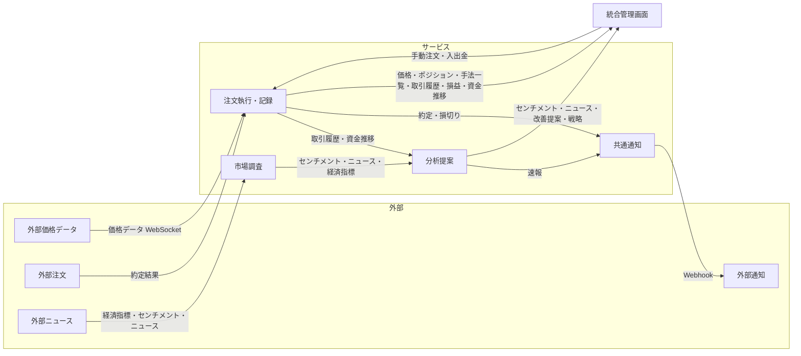

# 要件定義

## ビジネス要件

FX取引における情報収集・分析・注文執行を自動化するシステムを構築する。

- リアルタイム価格データをWebSocketで取得し、手法に応じた自動売買を行う
- LLMを用いた市場の感情分析・トピック分析で情報収集を行う
- 取引記録を蓄積し、AIで分析して手法の改善提案や価格急変時のシナリオ速報を行う

## 機能一覧

### 注文執行・記録サービス

| 機能 | 説明 |
|---|---|
| リアルタイム価格取得 | WebSocketでティックレベルの為替データを受信 |
| 自動注文 | 手法ルールに基づく完全自動売買（エントリー・決済・損切り） |
| 手動注文 | 管理画面からの裁量注文 |
| 取引管理 | 約定データの記録・管理 |
| 資金管理 | 資金の入出金記録 |

### 市場調査サービス

| 機能 | 説明 |
|---|---|
| 情報収集 | SNS・経済指標・ニュースの自動収集 |
| 感情分析 | LLMによる市場センチメント分析 |

### 分析提案サービス(AIによる横断分析)

| 機能 | 説明 |
|---|---|
| 速報分析 | 指標発表・価格急変時に状況とシナリオを生成して速報 |
| 戦略立案 | エントリーポイント・先行期の検討 |
| 改善提案 | 取引記録からアンチパターンと改善案を提案 |
| その他 | 各サービスから横断的かつagenticに情報を集めて思考 |

### 統合管理画面

| 機能 | 説明 |
|---|---|
| ダッシュボード | 損益・資金推移・手法別分析のチャート表示（旧trader UI） |
| 分析ビュー | センチメント・ニュース・改善提案・戦略の表示 |
| 手法管理 | トレード手法の一覧・選択（内容の編集は不可） |
| 注文パネル | 手動注文の発注UI |

## データフロー

- 注文執行・記録が手法データ・取引履歴・資金データを所有し、統合管理画面からは変更不可・取得のみ
- 共通通知モジュール: 各サービスから呼び出し、外部通知サービスに送信
- 具体的なサービス選定・API仕様・認証方式は運用デプロイ設計を参照
