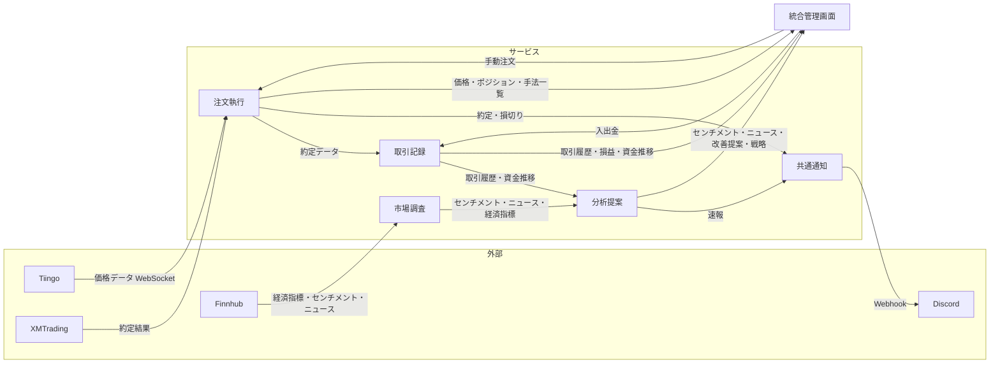

# 要件定義

## ビジネス要件

FX取引における情報収集・分析・注文執行を自動化するシステムを構築する。

- リアルタイム価格データをWebSocketで取得し、手法に応じた自動売買を行う
- LLMを用いた市場の感情分析・トピック分析で情報収集を行う
- 取引記録を蓄積し、AIで分析して手法の改善提案や価格急変時のシナリオ速報を行う

## 機能一覧

### 注文執行サービス

| 機能 | 説明 |
|---|---|
| リアルタイム価格取得 | WebSocketでティックレベルの為替データを受信 |
| 自動注文 | 手法ルールに基づく完全自動売買（エントリー・決済・損切り） |
| 手動注文 | 管理画面からの裁量注文 |

### 市場調査サービス

| 機能 | 説明 |
|---|---|
| 情報収集 | SNS（X）・経済指標・ニュースの自動収集 |
| 感情分析 | LLMによる市場センチメント分析 |

### 取引記録サービス

| 機能 | 説明 |
|---|---|
| 取引管理 | 注文執行からの約定データを記録・管理 |
| 資金管理 | 資金の入出金記録 |

### 分析提案サービス

| 機能 | 説明 |
|---|---|
| 速報分析 | 指標発表・価格急変時に状況とシナリオを生成して速報 |
| 戦略立案 | AIによるエントリーポイント・先行期の検討 |
| 改善提案 | 取引記録からアンチパターンと改善案を提案 |
| その他 | 各サービスから横断的かつagenticに情報を集めて思考 |

### 統合管理画面

| 機能 | 説明 |
|---|---|
| ダッシュボード | 損益・資金推移・手法別分析のチャート表示（旧trade-dashboard UI） |
| 分析ビュー | センチメント・ニュース・改善提案・戦略の表示 |
| 手法管理 | トレード手法の一覧・選択（内容の編集は不可） |
| 注文パネル | 手動注文の発注UI |

## データフロー

- **注文執行** が手法データを所有（統合管理画面からは閲覧・選択のみ、内容の変更は不可）
- **共通通知モジュール** → 各サービスから呼び出し、Discord Webhookに送信

## 情報ソース

### 価格データ

| 用途 | ソース | 方式 | 備考 |
|---|---|---|---|
| 為替リアルタイム価格 | Tiingo (Free) | WebSocket | ティックレベル、140+ペア、bid/ask対応 |
| 注文執行 | XMTrading | ブローカーAPI | 口座開設済み（確定） |

### 市場情報

| 用途 | ソース | 方式 | 備考 |
|---|---|---|---|
| 経済指標・センチメント・ニュース | Finnhub (Free) | REST + WebSocket | 60回/分。経済カレンダー（実績・予想・前回値）、ソーシャルセンチメント（Twitter/Reddit/StockTwits集約）、金融ニュースを一括取得 |

- **方針**: Finnhub一本でスタートし、不足を感じた領域を個別APIで補完
- **補完候補**: Telegram監視（トレーダー会話、無料）、GNews（日本語ニュース、$0〜$49.99/月）、FRED（米国指標時系列、無料）

### 通知

| 用途 | ソース | 方式 | 備考 |
|---|---|---|---|
| 速報・約定・損切り通知 | Discord | Webhook | サーバーにWebhookで送信 |

### 価格データAPI比較（為替限定）

| サービス | 月額 | WebSocket | 更新頻度 | 為替ペア数 | bid/ask | 金(XAU) | 備考 |
|---|---|---|---|---|---|---|---|
| **Tiingo** (Free) | $0 | ○（firehose） | ティックレベル（μs） | 140+ | ○ | △（40+ FXティッカーに含む） | REST: 50req/時, 1,000/日。個人利用のみ |
| **Tiingo** (Power) | $10/mo | ○（firehose） | ティックレベル（μs） | 140+ | ○ | △ | REST: 5,000req/時, 50,000/日。個人利用のみ |
| **Twelve Data** (Free) | $0 | △（8シンボル限定） | ~170ms | 2,000+ | × | ○（9貴金属） | REST: 8req/分, 800/日。お試し用途 |
| **Twelve Data** (Pro) | $229/mo | ○（1,500シンボル） | ~170ms | 2,000+ | × | ○（9貴金属） | REST: 1,597req/分。公式JS SDK無し |

- **データソース**: Tiingoはtier-1銀行+FXダークプールの生バイナリフィード。Twelve Dataは商業データプロバイダ+大手銀行
- **認証**: いずれもAPIキーのみ
- **利用制限**: 個人利用のみ（外部ユーザーへの表示にはCommercial/Businessプランが必要）
- **推奨**: 為替メインならTiingo無料プランから開始。金も必要な場合はTwelve Dataを検討

## 優先度

| Phase | 内容 | 前提条件 |
|---|---|---|
| 1 | モノレポ化 + WebSocketリアルタイムデータ取得（Tiingo） | なし |
| 2 | アナリスト：改善提案（既存取引データ活用） | なし |
| 3 | 自動注文（XMTrading API連携） | Phase 1、口座開設済み |
| 4 | 市場調査（ニュース・センチメント） | Finnhub APIキー取得 |
| 5 | アナリスト：戦略立案（β） | Phase 2, 3, 4 |
