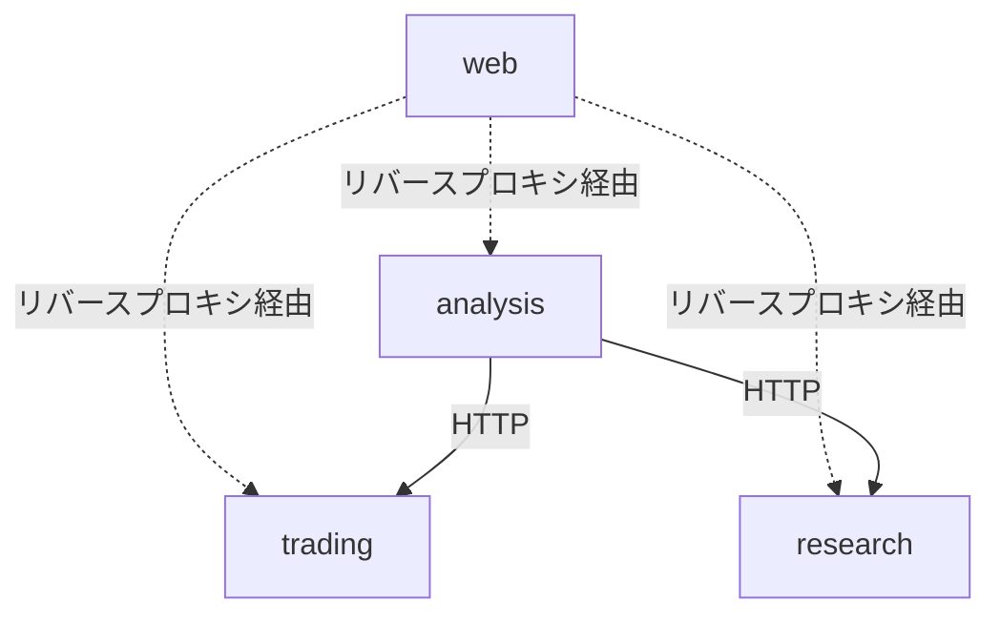

# アーキテクチャ設計

## モノレポ構成

pnpm workspaces + Turborepoで管理する。

```
trade-dashboard/
├── services/
│   ├── trading/          # 注文執行・取引記録サービス（非公開・自分専用）
│   ├── research/         # 市場調査サービス
│   └── analysis/          # 分析提案サービス
├── apps/
│   └── web/              # 統合管理画面（Next.js）
├── packages/
│   ├── shared/           # 共有型定義・Zodスキーマ
│   └── notify/           # 共通通知ライブラリ（Discord Webhook）
├── turbo.json
├── pnpm-workspace.yaml
└── package.json
```

- 各 `services/*` は独立プロセスとして動作する
- サービス間はHTTP(REST)で通信する
- `packages/shared` にサービス間の共有型・Zodスキーマを配置する
- `packages/notify` はライブラリとしてtrading・analysisから利用する

## サービス分割

| サービス | 責務 | 公開 | 依存サービス |
|---|---|---|---|
| `trading` | 価格取得・自動注文・手動注文・手法管理・取引記録・資金管理 | 非公開 | なし |
| `research` | 外部情報収集・LLMセンチメント分析 | 将来公開 | なし |
| `analysis` | 速報分析・戦略立案・改善提案 | 将来公開 | `trading`, `research` |
| `web` | 統合管理画面UI | 将来公開 | 全サービス（HTTP/WS経由） |

### 依存関係



- `notify` はライブラリのためこの図には含まない（trading・analysisが直接利用）
- `trading`・`research` は他サービスに依存しない末端サービス

## 技術スタック

| レイヤー | 技術 | 選定理由 |
|---|---|---|
| 言語 | TypeScript | フロント・バック統一、型安全 |
| フロントエンド | Next.js (App Router) | ファイルルーティング・API Routes活用 |
| UIライブラリ | React + Tailwind CSS + shadcn/ui | 高速なUI構築 |
| チャート | Recharts | React統合・軽量 |
| バックエンド | Hono | 軽量・高速・各サービスで独立したHTTPサーバー |
| ORM | Drizzle ORM | 型安全・軽量・SQLに近い設計 |
| DB | PostgreSQL | JSON型・Window関数・拡張性 |
| バリデーション | Zod | ランタイム型検証・サービス間スキーマ共有 |
| モノレポ | pnpm workspaces + Turborepo | 高速ビルド・キャッシュ |
| リンター | Biome | Lint + Format統合・高速 |
| リバースプロキシ | Caddy | 自動HTTPS・設定がシンプル |
| ホスティング | Hetzner Cloud (VPS) | コスパ最良・帯域20TB・全サービス1台同居 |
| コンテナ | Docker Compose | 全サービス+DB+Caddyを一括管理 |
| IaC | Terraform + cloud-init | VPS構築の再現性確保・初期設定自動化 |
| CI/CD | GitHub Actions | mainへのpush時に自動デプロイ |

## 通信方式

### クライアント ↔ サービス（リバースプロキシ経由）

専用ドメイン1つでCaddyがパスベースルーティングする。

```
trade.example.com/api/trading/*  → tradingサービス (:3001)
trade.example.com/api/research/* → researchサービス (:3002)
trade.example.com/api/analysis/*  → analysisサービス (:3003)
trade.example.com/*              → web (:3000)
```

| 種別 | 方式 | 用途 |
|---|---|---|
| CRUD操作 | REST (HTTP) | 取引履歴照会・入出金・手動注文・手法選択 |
| リアルタイムデータ | WebSocket | 価格ティック・ポジション状態の配信 |

### サービス間

HTTP(REST)で通信する。リクエスト・レスポンスの型は `packages/shared` のZodスキーマで共有し、型安全を担保する。

### サービス → 外部

| 接続先 | 方式 | 利用サービス | 備考 |
|---|---|---|---|
| 外部価格データ | WebSocket（常時接続） | trading | 価格データ受信。切断時は自動再接続 |
| 外部注文 | ブローカーAPI | trading | 注文発注・約定結果取得 |
| 外部ニュース | REST + WebSocket | research | 経済カレンダー・ニュース取得 |
| 外部通知 | HTTP (Webhook) | trading, analysis（notify経由） | 通知送信（速報・約定・損切り） |
| 外部LLM | HTTP (REST) | research, analysis | 分析・センチメント解析 |

具体的なサービス選定・認証・レート制限の詳細は運用デプロイ設計を参照。
