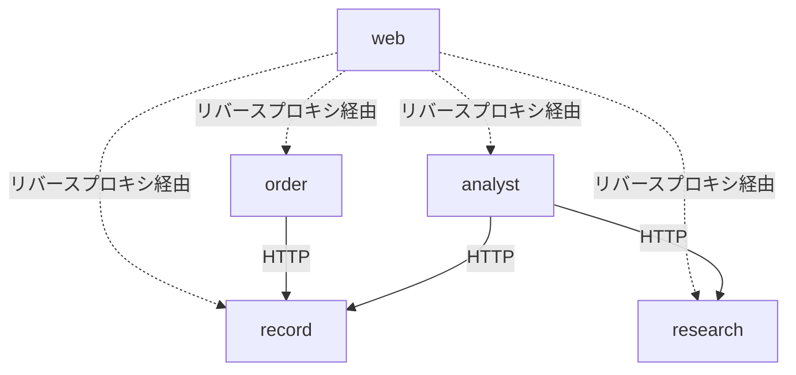

# アーキテクチャ設計

## モノレポ構成

pnpm workspaces + Turborepoで管理する。

```
trade-dashboard/
├── services/
│   ├── order/            # 注文執行サービス（非公開・自分専用）
│   ├── research/         # 市場調査サービス
│   ├── record/           # 取引記録サービス
│   └── analyst/          # 分析提案サービス
├── apps/
│   └── web/              # 統合管理画面（Next.js）
├── packages/
│   ├── shared/           # 共有型定義・Zodスキーマ
│   └── notify/           # 共通通知ライブラリ（Discord Webhook）
├── turbo.json
├── pnpm-workspace.yaml
└── package.json
```

- 各 `services/*` は独立プロセスとして動作する
- サービス間はHTTP(REST)で通信する
- `packages/shared` にサービス間の共有型・Zodスキーマを配置する
- `packages/notify` はライブラリとしてorder・analystから利用する

## サービス分割

| サービス | 責務 | 公開 | 依存サービス |
|---|---|---|---|
| `order` | 価格取得・自動注文・手動注文・手法管理 | 非公開 | `record` |
| `research` | 外部情報収集・LLMセンチメント分析 | 将来公開 | なし |
| `record` | 約定データ記録・資金管理・取引履歴照会 | 将来公開 | なし |
| `analyst` | 速報分析・戦略立案・改善提案 | 将来公開 | `record`, `research` |
| `web` | 統合管理画面UI | 将来公開 | 全サービス（HTTP/WS経由） |

### 依存関係



- `notify` はライブラリのためこの図には含まない（order・analystが直接利用）
- `record`・`research` は他サービスに依存しない末端サービス

## 技術スタック

| レイヤー | 技術 | 選定理由 |
|---|---|---|
| 言語 | TypeScript | フロント・バック統一、型安全 |
| フロントエンド | Next.js (App Router) | ファイルルーティング・API Routes活用 |
| UIライブラリ | React + Tailwind CSS + shadcn/ui | 高速なUI構築 |
| チャート | Recharts | React統合・軽量 |
| バックエンド | Hono | 軽量・高速・各サービスで独立したHTTPサーバー |
| ORM | Drizzle ORM | 型安全・軽量・SQLに近い設計 |
| DB | PostgreSQL | JSON型・Window関数・拡張性 |
| バリデーション | Zod | ランタイム型検証・サービス間スキーマ共有 |
| LLM | Claude API (Anthropic SDK) | 分析提案・センチメント分析 |
| モノレポ | pnpm workspaces + Turborepo | 高速ビルド・キャッシュ |
| リンター | Biome | Lint + Format統合・高速 |
| リバースプロキシ | Caddy | 自動HTTPS・設定がシンプル |

## 通信方式

### クライアント ↔ サービス（リバースプロキシ経由）

専用ドメイン1つでCaddyがパスベースルーティングする。

```
trade.example.com/api/order/*    → orderサービス (:3001)
trade.example.com/api/record/*   → recordサービス (:3002)
trade.example.com/api/research/* → researchサービス (:3003)
trade.example.com/api/analyst/*  → analystサービス (:3004)
trade.example.com/*              → web (:3000)
```

| 種別 | 方式 | 用途 |
|---|---|---|
| CRUD操作 | REST (HTTP) | 取引履歴照会・入出金・手動注文・手法選択 |
| リアルタイムデータ | WebSocket | 価格ティック・ポジション状態の配信 |

### サービス間

HTTP(REST)で通信する。リクエスト・レスポンスの型は `packages/shared` のZodスキーマで共有し、型安全を担保する。

### サービス → 外部

| 接続先 | 方式 | 利用サービス | 備考 |
|---|---|---|---|
| Tiingo | WebSocket（常時接続） | order | 価格データ受信。切断時は自動再接続 |
| XMTrading | ブローカーAPI | order | 注文発注・約定結果取得 |
| Finnhub | REST + WebSocket | research | 経済カレンダー・ニュース取得（60req/分） |
| Discord | HTTP (Webhook) | order, analyst（notify経由） | 通知送信（速報・約定・損切り） |
| Claude API | HTTP (REST) | research, analyst | LLMによる分析・センチメント解析 |

## 外部サービス連携

### Tiingo（価格データ）

- WebSocket firehose接続で為替ティックデータを受信
- 接続管理: 起動時に接続、切断時に指数バックオフで再接続
- 受信データ: bid/ask/mid価格・タイムスタンプ
- 認証: APIキー（クエリパラメータ）

### XMTrading（注文執行）

- ブローカーAPIで注文発注・ポジション管理
- 約定結果を取引記録サービスにHTTPで連携

### Finnhub（市場情報）

- REST APIで経済カレンダー・ニュース・センチメントを定期取得
- レート制限: 60req/分を遵守するようリクエストキューで制御

### Discord（通知）

- `packages/notify` ライブラリ経由でWebhook URLにPOST
- 通知種別: 速報（analyst）・約定/損切り（order）

### Claude API（LLM）

- Anthropic SDKでセンチメント分析・改善提案・戦略立案を実行
- 利用サービス: research（センチメント分析）・analyst（改善提案・戦略立案・速報分析）
